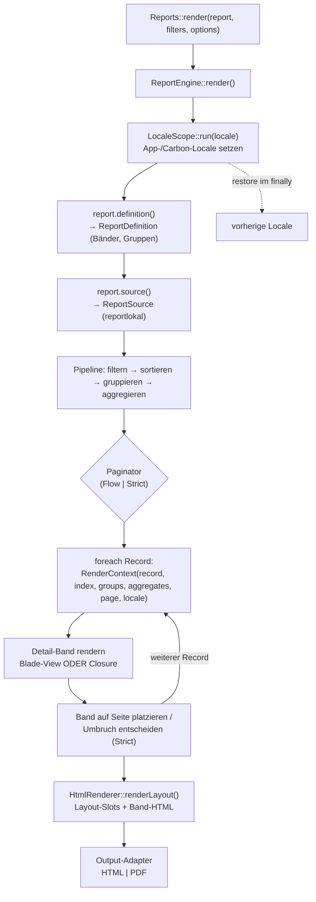

# guggach/laravel-reports — Spezifikation

Status: Entwurf 0.1 · Stand: 2026-10-07
Die ursprüngliche Ideensammlung liegt unverändert in [`docs/spec-notes.md`](spec-notes.md).

---

## 0. Kurzfassung

`guggach/laravel-reports` ist ein Laravel-Paket, mit dem ein Entwickler **druckfertige Reports** definiert (Rechnung, Liste, Auswertung), sie **serverseitig mit PHP/Blade rendert** und als **HTML/PDF** (später Word/Excel) ausgibt. Das Besondere ist ein **Band-/Seitenmodell** mit Kopf-/Fusszeilen, verschachtelten Gruppen und optionaler **strikter Platzierung** (Rechnung, Einzahlungsschein) – genau das, was reine HTML→PDF-Tools nicht leisten.

Leitprinzipien:

1. **Der Report wird immer serverseitig gerendert** – mit PHP und/oder Blade. Der Entwickler hat dort vollständige Freiheit über das Markup.
2. **Filterformular und HTML-Anzeige-Frame sind optional** und stack-abhängig (Blade/Livewire, Inertia Vue/React). Die Report-Erzeugung selbst hängt **nicht** vom Frontend-Stack ab.
3. **PHP-first:** Reportdefinitionen sind PHP-Klassen. JSON/XML ist eine spätere, dünne Serialisierungs-Schicht auf dasselbe interne Modell.
4. **Ein Renderer (Chromium), zwei Modi:** *Flow* (Browser paginiert) und *Strict* (fixe Bandhöhen, arithmetische Seitenaufteilung).
5. **Layouts:** wiederverwendbare, einbindbare Layouts (Blade/Vue/React) sichern ein einheitliches Aussehen (Logo, Kopf/Fuss, Typografie) über mehrere Reports hinweg.
6. **Jeder Report ist in sich konsistent (self-contained).** Report, Datenquellen und Bänder liegen in einem Modul und werden **nicht zwischen Reports geteilt** – das vermeidet versteckte Kopplung und Seiteneffekte, wenn ein Report geändert wird. Einzige Ausnahme ist das geteilte **Layout** (Corporate Identity).

---

## 1. Ausgangslage

Laravel ist hervorragend für Webseiten und CRUD-Formulare, diese sind aber schlecht druckbar: keine Seitenvoransicht, keine Kopf-/Fusszeilen, keine verlässliche Seitenaufteilung, kein PDF.

Reporttypen, die das Paket abdecken soll:

- **Einzelformular** – Felder über die Seite verteilt (z. B. Rechnung, Anschreiben, Einzahlungsschein). Ein Formular wird aus **je einem Datensatz** erzeugt; bei mehreren Datensätzen wird das Formular je Datensatz wiederholt (z. B. mehrere Rechnungen in einem Lauf).
- **Liste** – Loop über eine Datenmenge, Excel-ähnlich, mehrzeilig pro Detailzeile (z. B. Preisliste, Buchungsliste).
- **Klassischer Spaltenreport** – Sonderform der Liste: Spalten mit Label, Wert (Feldname oder Closure), Formatierung, Ausrichtung und optionaler Summenzeile; schnell definierbar, ohne eigenes Band-Markup.

---

## 2. Abgrenzung zu bestehenden Paketen

| Ansatz | Was er liefert | Was fehlt |
|---|---|---|
| `barryvdh/laravel-dompdf`, `snappy/wkhtmltopdf` | HTML → PDF | Kein Band-/Seitenmodell, kein CSS-Grid/Flex, eingeschränktes Layout |
| `elgibor-solution/laravel-report-builder` | Metadaten-getriebene **Tabelle**, Queries, Filter-Operatoren, Aggregate, Exporte, History, Security | Keine Bänder, keine Kopf-/Fusszeile, keine verschachtelten Gruppen-Bänder, keine strikte Seitenplatzierung; Definitionen in der DB, ein generischer View |
| `jimmyjs/laravel-report-generator` | Fluentes `of($title,$meta,$query,$columns)`, Spalten mit Closures, `groupBy`+`showTotal`, `stream/download/store`, PDF (dompdf/snappy) + Excel/CSV | Kein Band-/Seitenmodell, keine Kopf-/Fusszeile, keine Strict-Platzierung; rein spaltenbasiert |

**Differenzierer dieses Pakets:** das Band-/Seitenlayout (Page-Bänder, verschachtelte Gruppen, drei Reportarten inkl. Spaltenreport, Strict-Placement) **plus** volle Blade-Freiheit im Report selbst und einbindbare Layouts.

Gute Ideen aus dem Umfeld werden übernommen (Feld-/Parameter-DTOs, Type→Operator→Format-Map, `ReportSource`-Klassen, swappable Renderer/Exporter, Source als Trust-Boundary, fluente Ausgabe-Verben und das Spaltenreport-Muster), aber das Paket bleibt eigenständig.

---

## 3. Grundbegriffe und Modell

### 3.1 Objekte

- **Report** – eine PHP-Klasse (`App\Reports\...`), die Datenquelle, Bänder, Filter, Gruppierung, Aggregate und Seiteneinrichtung definiert.
- **ReportDefinition** – internes, unveränderliches DTO-Modell. Eingänge: PHP-Builder, später JSON-Loader. Ausgänge: Renderer, Validierung, Schema für die Filterformulare.
- **ReportSource** – liefert die Datenmenge + Felddefinitionen (`ReportField`, `ReportParameter`).
- **Band** – ein Block auf voller Breite mit fester Höhe (`height`) oder Mindesthöhe (`minHeight`) und Umbruch-Regeln.
- **Detail** – das zentrale Band, das pro Datensatz einmal gerendert wird.
- **Gruppe** – Sortier-/Gruppierungsschlüssel; löst Gruppenkopf/-fuss je Level aus (verschachtelbar).
- **Aggregat / virtuelles Rechenfeld** – wird bei jedem Detail aktualisiert; in Gruppenfüssen und im Report-Fuss verfügbar.
- **Filter** – Eingaben des Aufrufers oder (optional) des Filterformulars; schränken die Datenmenge ein.
- **Preset** – gespeicherte Kombination aus Filtern + Sortierung.
- **Output** – Ausgabeformat (HTML, PDF, später Word/Excel) inkl. optionaler Speicherung.
- **Layout** – wiederverwendbares äusseres Gerüst (Logo, Kopf-/Fuss-Chrome, Typografie, Farben, CSS), das ein Report einbindet. Wird serverseitig als Blade-View/Component gepflegt (Vue/React nur für den Vorschau-Frame).

### 3.2 Bänderstapel

Reihenfolge pro Report/Seite (von aussen nach innen):

```
Page Header                      (nur seitenorientiert)
  Report Start Title
  Grid Header (pro Seite wiederholt)
    Group Header Level 1
      Group Header Level 2
        ...
          Detail  ← pro Datensatz, zentral
        ...
      Group Footer Level 2
    Group Footer Level 1
  Report End Footer
Page Footer
```

### 3.3 Zwei Reportarten

| | Einzelformular | Liste |
|---|---|---|
| Datenmenge | n Datensätze (n Formulare; häufig n = 1) | n Datensätze |
| Detail-Band | pro Datensatz einmal; erzeugt ein vollständiges, eigenständiges Formular (z. B. eine Rechnung) | pro Datensatz, typ. Gridzeile |
| Bruchverhalten | „nicht mitten durchbrechen" pro Feldgruppe; Formulare laufen nicht ineinander | pro Detailzeile kein Umbruch |
| Gesamtseiten | bekannt nach Pagination (je Formular bzw. über alle Formulare) | oft erst nach Pagination |
| Modus | meist **Strict** | meist **Flow** |

**Einzelformular ≠ nur ein Datensatz:** Die Datenmenge ist nicht grundsätzlich auf einen Datensatz beschränkt. Werden z. B. mehrere Rechnungen in einem Lauf erzeugt, ist **jeder Detail-Datensatz ein vollständiges Einzelformular**. Bei zwei Rechnungen wird das Einzelformular also zweimal ausgeführt – je Datensatz einmal. Das Detail-Band (Formular-Markup) bleibt dabei identisch; die Engine wiederholt es pro Datensatz und trennt die Wiederholungen sauber (Seitenumbruch bzw. eigenständiger Strict-Container je Formular), sodass keine Formulare ineinanderlaufen. Die Abgrenzung zur Liste liegt daher **nicht** in der Anzahl Datensätze, sondern darin, dass ein Durchlauf des Detail-Bands ein in sich geschlossenes Formular ergibt, während die Liste kompakte, fortlaufende Detailzeilen erzeugt. Umfasst ein Formular mehrere Seiten (z. B. eine dreiseitige Rechnung), muss der Seitenzähler **je Formularinstanz** neu bei 1 beginnen können – siehe 6.6.

Ein **klassischer Spaltenreport** ist die einfachste Ausprägung der Liste: Spalten = Label + Feld/Closure + Format + Ausrichtung, plus optionale Fuss-Summe. Er nutzt intern dieselbe Band-Pipeline (Grid-Header, Detailzeile, Report-Fuss), benötigt aber kein eigenes Blade-Markup.

---

## 4. Architektur

### 4.1 Schichten

```
Definition (PHP/DTO/JSON)
      │
Data (ReportSource → Query/Collection)
      │
Pipeline: filtern → sortieren → gruppieren → aggregieren
      │
Rendering: Blade-Bänder (server-side, PHP/Blade)
      │
Pagination-Assembler:  Flow  |  Strict
      │
Output-Adapter: HTML · PDF · (Word · Excel · CSV)
```

### 4.2 Zentrale Contracts / Klassen (Vorschlag)

```
Guggach\Reports\ReportsServiceProvider
Guggach\Reports\Facades\Reports                // Reports::render(), ::run(), ::presets()

Guggach\Reports\Report                          // Basisklasse, die der Entwickler erbt
Guggach\Reports\Sources\ReportSource            // abstrakte Basis: fields(), parameters(), records()
Guggach\Reports\Sources\ReportField
Guggach\Reports\Sources\ReportParameter
Guggach\Reports\Sources\EloquentSource          // Eloquent Model/Builder
Guggach\Reports\Sources\QuerySource             // DB::table(...), optional Connection
Guggach\Reports\Sources\RawSqlSource            // DB::select() mit Bindings/Connection
Guggach\Reports\Sources\CollectionSource        // Illuminate\Support\Collection
Guggach\Reports\Sources\ArraySource             // array (in-memory)

Guggach\Reports\Definition\ReportDefinition     // DTO
Guggach\Reports\Definition\ReportBuilder
Guggach\Reports\Definition\GroupDefinition      // Level, Keys, enrichWith()/drivesWith(), Bänder, Aggregate (geordnete Liste)
Guggach\Reports\Definition\Bands\Band
Guggach\Reports\Definition\Bands\PageHeader | PageFooter
Guggach\Reports\Definition\Bands\ReportStart | ReportEnd
Guggach\Reports\Definition\Bands\GridHeader
Guggach\Reports\Definition\Bands\GroupHeader | GroupFooter
Guggach\Reports\Definition\Bands\Detail
Guggach\Reports\Definition\PageSetup
Guggach\Reports\Definition\ReportMode            // enum: Flow | Strict

Guggach\Reports\Layouts\Layout                   // Layout-Basisklasse (Slots, CSS, Vererbung)
Guggach\Reports\Layouts\LayoutRegistry

Guggach\Reports\Engine\ReportEngine             // Orchestrierung der Pipeline
Guggach\Reports\Engine\GroupResolver            // Run-basiert (Default) oder Top-Down (Source je Level)
Guggach\Reports\Engine\GroupContext             // Level, Keys/Run, Gruppendaten, Kind-Parameter
Guggach\Reports\Engine\AggregateResolver
Guggach\Reports\Engine\BandRenderer             // rendert ein einzelnes Band (Interface)
Guggach\Reports\Engine\FlowPaginator            // Flow-Assembler; hier liegt die Record-Schleife
Guggach\Reports\Engine\Paginator                 // Flow- und Strict-Implementierung (Strict folgt)
Guggach\Reports\Engine\RenderContext             // Datenkontext für Blade-Bänder
Guggach\Reports\Engine\LocaleScope               // setzt/restauriert App- & Carbon-Locale, verschachtelbar (Run/Detail)

Guggach\Reports\Aggregates\Aggregate             // Interface
Guggach\Reports\Aggregates\Sum | Avg | Count | Min | Max

Guggach\Reports\Filters\FilterBag
Guggach\Reports\Filters\FilterField
Guggach\Reports\Filters\PresetRepository

Guggach\Reports\Contracts\ReportRenderer         // html | pdf | ... (Default: HtmlRenderer)
Guggach\Reports\Renderers\HtmlRenderer           // Bänder + Layout → HTML
Guggach\Reports\Contracts\Exporter               // word | excel | csv (v2)
Guggach\Reports\Output\OutputOptions
```

### 4.3 Rendering = immer server-side

Der Reportinhalt wird mit **Blade** (oder reinem PHP) gerendert. Jedes Band erhält einen `RenderContext` (Report, Datensatz, Gruppenzustand, Aggregate, Seiteninfo, Filter). Der Entwickler schreibt das Markup frei.

Wichtig: Die optionalen UI-Stubs (Abschnitt 11) rendern **nur** das Filterformular und den umgebenden Frame. **Sie rendern nie den Report selbst.**

### 4.4 Ausführungsablauf (Record für Record)

Dieser Ablauf ist zentral für das Verständnis und sollte auch in der Entwickler-Doku mit Grafik stehen. Die **Record-Schleife** liegt im **Paginator/Band-Assembler**, nicht im Renderer (der Renderer ist nur die Ausgabestufe).



Ablauf in Worten (entspricht den Bau-Schritten a/b):

1. `ReportEngine` öffnet einen `LocaleScope` (setzt App-/Carbon-Locale, restauriert danach).
2. `Report::definition()` liefert die `ReportDefinition` (Bänder, Gruppen, PageSetup, Layout).
3. `Report::source()` liefert die `ReportSource`; die Pipeline filtert/sortiert/gruppiert/aggregiert.
4. Der **Paginator** iteriert die Datensätze und baut **pro Record** einen `RenderContext`.
5. Das **Detail-Band** wird pro Record gerendert (Blade-View oder Closure mit `RenderContext`).
6. `HtmlRenderer` setzt die Bänder in die Layout-Slots; der Output-Adapter liefert HTML/PDF.

Kernaussage für Entwickler: Ein Record = ein Durchlauf des Detail-Bands. Der `RenderContext` ist der einzige Übergabepunkt zwischen Engine und Blade-Markup.

---

## 5. Definition und API

### 5.1 Report-Basisklasse (Skizze)

```php
namespace App\Reports\PriceList;

use Guggach\Reports\Report as BaseReport;
use Guggach\Reports\Definition\ReportBuilder;
use Guggach\Reports\Definition\PageSetup;   // nur bei Layout-Override nötig

final class Report extends BaseReport
{
    public function key(): string  { return 'price_list'; }
    public function name(): string { return 'Preisliste'; }

    /** Datenquelle: austauschbarer Adapter (siehe 7.1). */
    public function source(): \Guggach\Reports\Sources\ReportSource
    {
        return new Source($this->filters());   // App\Reports\PriceList\Source
    }

    /** Band-, Filter- und Aggregatdefinition. */
    public function define(ReportBuilder $r): void
    {
        // Papierformat, Orientierung und Ränder kommen aus Config bzw. Layout
        // (Abschnitt 5.5 / 13) und werden hier nur bei Abweichung überschrieben:
        // $r->pageSetup(PageSetup::a4()->landscape());

        $r->detail(view: 'detail', height: 6)          // → <Modul>/views/detail.blade.php
          ->repeatGridHeader(view: 'grid-head');

        $r->pageHeader(view: 'header')->height(15)->hideOnFirstPage();
        $r->pageFooter(view: 'footer')->height(12);    // enthält Seitenzahlen

        // Gruppen verschachtelt: Reihenfolge = Level 1..n
        $r->group('category', function ($g) {
            $g->header(view: 'category-head')
              ->footer(view: 'category-foot')
              ->aggSum('price', as: 'category_total')
              ->enrichWith(CategoryInfo::class);   // Zusatzdaten einmal pro Gruppe (7.4)

            $g->group('brand', function ($g) {
                $g->header(view: 'brand-head');
            });
        });

        $r->aggregate('grand_total', Sum::class, field: 'price', scope: 'report');
    }
}
```

### 5.2 Integrationsstufen

Ein Report kann auf zwei Stufen definiert werden – die Report-Engine kennt beide:

1. **Free-form (L1):** Der Entwickler liefert ein komplettes Blade-View. Das Paket kümmert sich um Filter, PDF-Konvertierung, Seite, Speicherung und den Frame. Maximale Freiheit, minimale Struktur.
2. **Banded (L2):** Der Entwickler deklariert Bänder; das Paket übernimmt Wiederholung (Grid-/Gruppenköpfe), Pagination, Aggregate und Platzhalter. Blade-Inhalte bleiben frei.

Beide Stufen nutzen denselben `ReportEngine` und dieselben Output-Adapter; L2 ergänzt den Band-Assembler.

### 5.3 Definitionen speichern (Report-Module)

- Default-Basispfad: `app_path('Reports')` (Config `reports.path`, änderbar). Namespace `App\Reports` – damit ist **keine** Composer-Anpassung nötig (Laravel mappt `App\` auf `app/`).
- **Ein Report = ein Modulordner.** Alles, was zum Report gehört, liegt in diesem einen Ordner – keine Trennung mehr zwischen `app/`-Klassen und Blade-Views:
  ```
  app/Reports/
  ├─ Layout/               ← geteiltes CI-Layout (einzige Ausnahme, siehe 5.5)
  └─ PriceList/
     ├─ Report.php         → App\Reports\PriceList\Report  (extends Guggach\Reports\Report)
     ├─ Source.php         → optional (ReportSource-Adapter, siehe 7.1)
     ├─ Layout.php         → optional (nur bei echtem Sonderfall)
     ├─ lang/
     │  ├─ de.php
     │  └─ en.php
     └─ views/
        ├─ detail.blade.php
        ├─ grid-head.blade.php
        ├─ header.blade.php
        └─ footer.blade.php
  ```
  Der Ordner ist self-contained: Report, Datenquellen und Bänder liegen beieinander und gehören **nur diesem Report**. Es gibt bewusst **keine geteilten Report-Sources** – nur das Layout (5.5) ist report-übergreifend. So kann ein Report geändert werden, ohne andere zu beeinflussen (Leitprinzip 6).
- **Einzige Ausnahme: geteilte Layouts.** Weil das Layout die Corporate Identity trägt und für die meisten Reports **identisch** ist, liegt es zentral unter `app/Reports/Layout/` (Config `reports.layout_path`) – ein Report referenziert es, statt eine Kopie anzulegen. Module können zusätzlich ein eigenes `Layout.php` haben, wenn sie wirklich abweichen.
- **Ordner-/Klassennamen:** Modulordner in `StudlyCase`, Hauptklasse konventionell `Report` (Discovery via `*/*/Report.php`), optional `Source`/`Layout`. Der stabile Report-Key kommt aus `key()` (z. B. `price_list`).
- **Autoload (Invariante):** `reports.path` und `reports.namespace` müssen ein **konsistentes PSR-4-Paar** bilden – der Pfad ist das PSR-4-Zielverzeichnis des Namespace. Das Paket registriert **keinen** Autoloader zur Laufzeit.
  - Liegen die Module unter `app/Reports/` (Namespace `App\Reports`), ist **keine** Anpassung nötig – Laravel mappt `App\` bereits auf `app/`.
  - Liegt der Pfad woanders (z. B. `resources/reports`), trägt der Entwickler den Namespace in `composer.json` unter `autoload.psr-4` ein, z. B. `"App\\Reports\\": "resources/reports/"`. `reports:install` gibt genau diesen Snippet aus; dokumentieren genügt, das Paket schreibt nichts selbst.
- **View-Auflösung:** Die `views/` jedes Moduls werden als Blade-Namespace registriert. Im Builder genügt daher der **relative** Name (`view: 'detail'`); voll qualifizierte View-Namen bleiben möglich.
- Ein optionaler JSON-Loader (v2) kompiliert Definitionsdateien in dasselbe `ReportDefinition`-DTO.

### 5.4 Artisan-Vorlagen

```
php artisan make:report {name} --template=blank|column-list|basic-list|banded-list|invoice
php artisan make:report-source {name}
php artisan make:layout {name} --stack=blade|vue|react
php artisan reports:install {--stack=blade-livewire|inertia-vue|inertia-react}
php artisan reports:list
```

Die `make:report`-Vorlagen erzeugen typische Listen-, Spalten- und Rechnungs-Gerüste als **Modulordner** (Klasse(n) + `views/`), die der Entwickler anpasst.

### 5.5 Layouts (einheitliches Aussehen)

Ein **Layout** ist das wiederverwendbare äussere Gerüst eines Reports: Logo, Absender, Kopf-/Fuss-Chrome, Typografie, Farben, Ränder und CSS/Fonts. Es stellt ein einheitliches Aussehen über mehrere Reports hinweg sicher.

**Definition und Einbindung**

```php
namespace App\Reports\Layout;               // geteiltes CI-Layout; abweichendes Layout im Report-Modul (z. B. App\Reports\PriceList\Layout)

use Guggach\Reports\Layouts\Layout;
use Guggach\Reports\Definition\PageSetup;

final class CompanyLayout extends Layout
{
    public function view(): string        { return 'layouts.company'; } // Blade-View
    public function baseLayout(): ?string { return 'layouts.base'; }    // Vererbung wie @extends

    /** Layout-Vorgabe für Papier/Ränder/Orientierung (Report kann überschreiben). */
    public function pageSetup(): ?PageSetup
    {
        return PageSetup::a4()->portrait()->marginsMm(20, 15, 20, 15);
    }
}
```

```php
// im Report
public function layout(): string { return CompanyLayout::class; }

// oder im Builder
$r->layout(CompanyLayout::class);
```

**Was ein Layout bereitstellt**

- äusseres HTML-Gerüst (`<html>`, `<head>` mit `<style>`/Fonts, `<body>`) für HTML und PDF.
- benannte **Regionen/Slots**: `header`, `footer`, `logo`, `content`. Die Bänder und Detailinhalte werden in `content` gerendert.
- Vorgaben für **Page Header/Footer**, die ein Report überschreiben kann.
- Vorgaben für **`PageSetup`** (Papiergrösse, Orientierung, Ränder, Einheit, dpi) – siehe Kaskade unten.
- die Anzeige der **Meta-Zeile** (aktive Filter/Sortierung).

**Seiteneinrichtung: Kaskade Config → Layout → Report**

`PageSetup` wird nicht in jedem Report wiederholt. Es gilt (niedrig → hoch, höher überschreibt):

1. **Paket-Config** `reports.paper` (Abschnitt 13) – die globalen Defaults (`a4`, `portrait`, Ränder, `mm`, `dpi`).
2. **Layout** `Layout::pageSetup()` – z. B. ein Rechnungslayout erzwingt engere Ränder.
3. **Report** – nur Abweichungen, z. B. `$r->pageSetup(PageSetup::a4()->landscape())` oder `Report::pageSetup()`.

Felder werden **feldweise** zusammengeführt (der Report muss nur die abweichenden Werte setzen); ohne Override bleibt der eingestellte Default. Analog gilt der Modus-Default `reports.default_mode` (Flow/Strict) als Fallback, sofern der Report nichts setzt.

**Renderer-Verhalten (v1, implementiert).** Der `HtmlRenderer` löst das Layout wie folgt auf: `Report::layout()` gewinnt über den Builder-Wert; ist der Wert eine `Layout`-Klasse, wird sie instanziiert und ihr `view()` gerendert, sonst als View-Name behandelt. Die Layout-View erhält:

| Variable | Inhalt |
|---|---|
| `content` | das gerenderte Report-HTML (Bänder) |
| `title` | `Report::name()` |
| `ctx` | der `RenderContext` |
| `report` | die `Report`-Instanz |
| `layout` | die `Layout`-Instanz (oder `null`) |
| `baseLayout` | `Layout::baseLayout()` (Blade-`@extends`-Hinweis) |
| `pageSetup` | aufgelöste `PageSetup` (Config → Layout → Report) |
| `meta` | Meta-Zeile aus `options['meta']` |

Hinweis: Die `PageSetup`-Kaskade ist in v1 **ganzheitlich** (erste gesetzte Ebene gewinnt); der **feldweise** Merge (z. B. nur die Ränder überschreiben) folgt.

Die mitgelieferten Layout-Templates `default` und `letterhead` liegen unter `resources/views/layouts/`.

**Layout vs. Bänder**

- *Layout* = Chrome, Theming und Seitengerüst (wiederverwendbar).
- *Bänder* = Inhalt und Wiederholungslogik (report-spezifisch).
- Ein Report ohne eigenes Layout nutzt das Paket-Default (`default`).

**Vorlagen und Stacks**

- Mitgeliefert: `default`, `letterhead` (Logo + Absender), `blank`; erzeugbar via `make:layout`.
- Ablage: **geteilt** unter `app/Reports/Layout/` (Config `reports.layout_path`) – die einzige Ausnahme vom Modulprinzip (Abschnitt 5.3). Ein Report referenziert das geteilte CI-Layout statt es zu kopieren; nur echte Abweichungen bekommen ein eigenes `Layout.php` im Modul.
- Layouts werden **immer serverseitig (Blade/PHP)** gerendert – auch wenn Filter-Formular und Vorschau-Frame in Vue/React laufen (Leitprinzip 1). Für den Frame gibt es separate, stack-spezifische Stubs.

**Vererbung / Verschachtelung**

- Ein Layout kann ein Parent-Layout erweitern (wie Blade `@extends`), z. B. Firmen-Grundlayout + rechnungs-spezifischer Kopf.

### 5.6 Mehrsprachigkeit (Übersetzungen)

Ein Report kann mehrsprachig sein. Der Aufrufer übergibt optional eine **Sprache**; ist keine gesetzt, gilt die App-Locale.

**Bestandteile**

- **Modul-eigene Lang-Dateien:** `app/Reports/<Name>/lang/<locale>.php` – Labels/Texte nur dieses Reports (nicht geteilt, Leitprinzip 6). Bei der Discovery wird jedes Modul als Laravel-Übersetzungs-Namespace registriert (Key = `key()`, z. B. `price_list::field.amount`).
- **Labels:** `ReportField`-/Filter-Labels und Band-Texte über das Modul-Namespace (`__('price_list::field.amount')`); die generierten Filter-/Spalten-Labels folgen der aktiven Sprache.
- **Blade:** reguläres `@lang`/`__()` in den Bändern.

**Laufzeit-Ablauf**

1. Aufruf mit Sprache: `Reports::render($report, $filters, locale: 'de')` bzw. `locale` in den Run-/`OutputOptions`.
2. Die Engine setzt die Locale **vor** dem Run (`App::setLocale($locale)`), merkt sich die vorherige und **stellt sie nach dem Run garantiert wieder her** (`try/finally`) – kein globaler Seiteneffekt, auch in Jobs/Queues.
3. Während des Runs ist die Locale in `RenderContext` und in der `ReportSource` verfügbar.

**Datenquellen & `spatie/laravel-translatable`**

- Die Locale ist **Teil des `ReportSource`-Kontexts** (`$this->locale()`). Zwei Muster:
  - **Translatable-Modelle:** Die Query läuft, während die App-Locale gesetzt ist → `spatie/laravel-translatable` liefert die korrekte Sprache; nach dem Run wird zurückgesetzt. Das Reports-Paket setzt nur die Locale – `spatie/laravel-translatable` bleibt eine **optionale Host-Abhängigkeit** (nicht im `require` des Pakets).
  - **Sprachspalte in der Tabelle:** Der Entwickler filtert selbst, z. B. `->where('lang', $this->locale())` oder `->whereIn('lang', [$this->locale(), $fallback])`.
- Gruppierungs-/Sortier-Keys sollten **sprachneutral** sein; sprachabhängige Labels gehören in die Übersetzung, nicht in die Gruppenschlüssel.

**Formatierung**

- Datum, Zahl und Währung folgen der Locale (`Number::currency`, `->isoFormat`, `Carbon::setLocale`); die Engine setzt und restauriert auch die Carbon-Locale (`try/finally`).

**Fallback & Richtung**

- Fallback über `config('reports.fallback_locale')` bzw. die App-Fallback-Locale.
- RTL: `lang`/`dir` am `<html>` aus der Locale setzen; das Layout kann pro Sprache Varianten/CSS bereitstellen.

**Konfiguration** (siehe 13): `locale` (Default `null` = App-Locale), `fallback_locale`, `locales` (Allow-List).

**Mehrere Sprachen in einem Output** (z. B. bilinguale Rechnung) ist bewusst **nicht** Teil von v1 – dafür genügen zwei Runs oder später mehrere Band-Sätze pro Sprache.

**Erweiterung (vX): Sprache pro Detail-/Formularinstanz.** Beim Druck von z. B. 10 Rechnungen haben die Vertragspartner oft **unterschiedliche Sprachen**. Deshalb ist die Locale nicht starr an den Run gebunden, sondern **pro Detailrecord auflösbar** – ohne Umbau später ergänzbar:

- `Detail::localeUsing(Closure|string|null $resolver)` – liefert die Sprache **je Datensatz**, z. B. `fn ($row) => $row->contract_language ?? $runLocale`. Default (v1) = Run-Locale (konstant).
- Die Engine setzt/t restauriert die Locale dann **pro Detail-/Formularinstanz** über einen verschachtelten `LocaleScope` (nicht nur einmal pro Run). `LocaleScope` ist von Anfang an verschachtelbar ausgelegt.
- **Datenebene:** Da die Detail-Query in der Regel **einmal vorab** läuft, muss sie für Per-Record-Sprachen **sprachneutral** sein (Fetch über IDs/Keys, z. B. Rechnungs-IDs). Die Übersetzung der Werte wird beim Rendern der Instanz aufgelöst (Translatable liest lazy) oder der Entwickler liefert die sprachspezifischen Werte pro Record mit. Report-Texte/Labels und Formatierung folgen der jeweiligen Instanz-Sprache.
- Gruppen können analog eine Sprache tragen (`GroupContext`), was im Top-Down-Modus besonders sauber ist (eine Sprache je Gruppe/Source).
- **v1 verhält sich identisch**, wenn kein Resolver gesetzt ist – es ist eine reine Erweiterung, kein Umbau.

---

## 6. Bänder im Detail

### 6.1 Eigenschaften eines Bands

| Property | Bedeutung |
|---|---|
| `height` | Fixe Höhe (Pflicht in **Strict**, optional in **Flow**) |
| `minHeight` | Mindesthöhe (Flow) |
| `keepTogether` | Band darf nicht mitten durchbrechen (Default `true` beim Detail) |
| `breakBefore` / `breakAfter` | Expliziter Seitenumbruch |
| `repeatOnNewPage` | Band nach Seitenumbruch wiederholen (Grid-Header) |
| `visibilities` | `hideOnFirstPage`, `hideOnLastPage`, `onlyOddPages`, `onlyEvenPages` |
| `pages` | explizite Seitenliste (z. B. `[1]`) |
| `formScope` | Markiert den Beginn einer **Formularinstanz** (Einzelformular, Abschnitt 6.6); jede Ausführung ist ein eigenständiges Formular |
| `restartPageNumber` | Setzt den Seitenzähler beim Start jeder Formularinstanz auf 1 zurück; `{pages}` zählt dann die Seiten des Formulars (Default bei Einzelformularen) |
| `localeUsing` | Resolver für die Sprache **je Detail-/Formularinstanz** (`fn ($row) => ...`); Default = Run-Locale (v1). Siehe 5.6 |
| `view` / `closure` | Blade-View oder Closure, erhält den `RenderContext` |

Höhen-Einheit und Bezugssystem werden über `PageSetup` (mm, A4, Ränder) definiert.

**Bänder sind Konfigurationsobjekte – mit Escape-Hatch (Variante A).** Der Normalfall ist ein Blade-`view` oder eine `closure`; der Builder erzeugt die eingebauten Band-Klassen (`Detail`, `PageHeader`, `GroupHeader`, …). Die Band-Klassen sind bewusst **nicht `final`**: Braucht ein Report eine eigene Klasse (z. B. die Generierung eines **Swiss QRR Einzahlungsscheins**), kann er ein Band-Subtyp bauen und die **Instanz** direkt an den Builder geben:

```php
$r->detail(new QrBillDetail(...));          // statt view: 'qrr'
$g->header(new MyGroupHeader(...));          // in der Gruppe
$r->pageFooter(new QrFooter, closure: fn ($ctx) => ...); // Instanz + Overrides
```

Die Slot-Methoden akzeptieren `Detail|string|null` usw. (Union), sind also rückwärtskompatibel. So bleibt „view“ der Normalfall, ohne einen Umbau zu erzwingen, wenn ein Sonderband nötig wird.

### 6.2 Page Header / Footer

- Nur für **seitenorientierte** Outputs (PDF, Druck, Word). Endlose Outputs (HTML-Stream, Excel) überspringen sie.
- Kopf startet bei `top 0,0`, Fuss bei `bottom 0,0`, jeweils fixe Höhe.
- Mehrere Kopf-/Fusszeilen möglich (Default + Seite-1-Sonderfall, odd/even), Auswahl über `visibilities`/`pages`.
- **Platzhalter** für `{page}`, `{pages}`, optional `{title}`, die je Modus gefüllt werden (siehe 10).

### 6.3 Report Start Title / End Footer

- Optional. Einfachste Form: statische Elemente (Titel, Erklärungen).
- Für komplexere Fälle: Datenklasse/Query, die **genau einen** Datensatz liefert (kein Loop).
- Aggregate sind im **Start** noch leer (keine Details verarbeitet) → dort statisch/single-record halten; im **End Footer** stehen alle Aggregate zur Verfügung.

### 6.4 Grid Header

- Wird nach einem Seitenumbruch vor den weiteren Details erneut ausgegeben.
- Empfehlung in **Flow**: echtes `<table><thead>` – Chromium wiederholt es automatisch.
- In **Strict**: Band `repeatOnNewPage = true`; der Assembler setzt es an den Anfang jeder neuen Seite eines laufenden Detail-Blocks.

### 6.5 Gruppen Header/Footer Level 1…n

- Bedingung: Änderung an einem oder mehreren definierten Attributen; beliebig verschachtelt.
- **Modell:** `ReportDefinition` hält die Gruppen als **geordnete Liste/Collection** `GroupDefinition[]`; die Position ergibt das Level (Index 0 → Level 1). Jede `GroupDefinition` trägt Keys, Header-/Footer-Band, Aggregate und optionalen Seitenumbruch. Gruppen sind **optional** (0…n); im Builder verschachtelt (`$g->group(...)` erzeugt Level 2) oder flach mit explizitem Level.
- **Datenbezug je Level:** Standard ist der Bezug aus dem Ergebnis der Detail-Source (Run-basiert, siehe 7.2). Zusätzlich kann **jedes Level eine eigene `ReportSource`** haben: **`enrichWith()`** holt einmal pro Gruppe Zusatzdaten/Aggregate (ohne die Detailzeilen per Join aufzublähen), **`drivesWith()`** lässt die Source die Schleife treiben (Top-Down). Ein `link`-Mapping (Keys/Feld-Mapping) parametrisiert die Gruppen-Source. Details siehe 7.4.
- Sortierung wird vom `GroupResolver` erzwungen (siehe 7.2).
- Datenbezug wie Report-Kopf/-Fuss (Query oder Aggregate).

### 6.6 Formularinstanzen und Seitenzähler

Ein Einzelformular wird pro Detail-Datensatz einmal ausgeführt (Abschnitt 3.3). Jede Ausführung ist eine **Formularinstanz** und kann **mehrere Seiten** umfassen (z. B. eine dreiseitige Rechnung). Damit `{page}`/`{pages}` sinnvoll bleiben, muss der Seitenzähler je Instanz zurückgesetzt werden können.

- Das Detail-Band markiert mit `formScope` (bzw. dessen Ausführung) den Beginn einer Formularinstanz.
- `restartPageNumber: true` setzt `{page}` beim Start jeder Instanz auf 1 zurück; `{pages}` liefert dann die Seitenzahl der **aktuellen Instanz**, nicht des Gesamtreports. Default bei Einzelformularen.
- Reportweit steuerbar über `pageNumbering: 'continuous' | 'perForm'` (Default `continuous`; Einzelformular-Vorlagen wie `invoice` setzen `perForm`).

Beispiel – zwei Rechnungen mit 2 bzw. 3 Seiten:

```
Rechnung 1:  Seite 1/2, 2/2
Rechnung 2:  Seite 1/3, 2/3, 3/3
```

- **Strict:** Der Assembler kennt die Formulargrenzen (jedes `formScope`-Detail bzw. jeder Instanzblock) und setzt den Zähler beim Aufbau der `.page`-Container zurück. Da die Pagination in PHP berechnet wird, sind `{page}` **und** `{pages}` pro Instanz im selben Durchlauf bekannt.
- **Flow:** Chromium zählt über das ganze Dokument. Ein Reset pro Instanz ist nur über CSS-`counter-reset` je Formular-Container bzw. einen zweiten Platzhalter-Durchlauf möglich und bleibt eingeschränkt. Für verlässliche Per-Formular-Seitenzahlen wird **Strict** empfohlen.
- `visibilities` wie `hideOnFirstPage`/`hideOnLastPage`/`onlyOddPages`/`onlyEvenPages` und `pages` beziehen sich bei aktiver Formularinstanz auf die Seiten **innerhalb** der Instanz.
- Der Zähler kann auch **innerhalb** eines Formulars neu starten (z. B. mehrteilige Rechnung mit eigenem Deckblatt) – dafür mehrere `formScope`-Instanzen definieren.

---

## 7. Daten und Aggregate

### 7.1 Datenquelle

Die Herkunft der Daten ist **kein `if/switch` in einer Klasse**, sondern je Ursprung ein eigener, austauschbarer Adapter. Der Entwickler wählt pro Report in `source()` den passenden Typ; die Engine kennt nur die gemeinsame Basis.

- `ReportSource` (abstrakt): `fields(): ReportField[]`, `parameters(): ReportParameter[]`, `records(): iterable`. Filter/Sortierung werden übergeben (`withFilters(FilterBag)`, `withSorts(...)`); der Adapter entscheidet über **Pushdown** (SQL `WHERE`/`ORDER BY`) vs. In-Memory.
- Adapter (v1): `EloquentSource` (Model/Builder), `QuerySource` (`DB::table(...)`), `RawSqlSource` (`DB::select()` mit Bindings), `CollectionSource`, `ArraySource`.
- **Keine eigenen DB-Treiber-Adapter:** ODBC, SQL Anywhere, eine temporale DB usw. sind Connections/Modelle des **Zielprojekts** – das Paket bringt dafür nichts mit. Solche Quellen sind normales `EloquentSource` oder `QuerySource`/`RawSqlSource` **mit der passenden Connection**; die Connection wird in der Source angegeben (`DB::connection('odbc')`, `->connection('temporal')`, oder das Model nutzt sie bereits).
- **Eine Datenklasse pro Quelle im Report-Modul**, die der Report in `source()` referenziert (`return new Source($this->filters());`). Konkrete Quellen sind **reportlokal** und werden **nicht zwischen Reports geteilt** (Leitprinzip 6) – nur die Adapter-/Basisklassen des Pakets sind übergreifend. So hat jede Änderung an einem Report ausschliesslich lokale Wirkung.
- Braucht dasselbe Query-Logisch mehrere Reports, gehört die gemeinsame Logik in die **Domänenschicht des Zielprojekts** (Repository/Query-Objekt); jeder Report kapselt seinen eigenen Source-Wrapper darauf. Der Report bleibt der Eigentümer seiner Source.
- **Locale im Kontext:** Die aktive Sprache ist über `$this->locale()` (und im `RenderContext`) verfügbar, damit Queries entweder die gesetzte App-Locale nutzen (Translatable) oder selbst über eine Sprachspalte filtern (siehe 5.6).
- Die **Gruppierung** erfolgt im Default **run-basiert** durch den `GroupResolver` auf der normierten Detail-Datenmenge; hat ein Level eine eigene Source (7.4), liefert diese die Gruppenzeilen und der Resolver nur noch die Hierarchie. Die Sortierung darf (muss aber nicht) der Adapter per Pushdown liefern.
- **Sicherheit:** Quellen und Feldnamen kommen ausschliesslich vom Entwickler. Enduser liefern nie Roh-SQL oder Spaltennamen (Allow-List); `RawSqlSource` bindet Werte und akzeptiert keine Enduser-SQL.

### 7.2 Gruppierung und Sortierung

- Mehrere Gruppenschlüssel, in dieser Reihenfolge sortiert (stabil).
- Die Gruppen kommen aus der geordneten `GroupDefinition[]` (Abschnitt 6.5): **Position = Level (1…n)**; jede Gruppe kann einen oder mehrere Keys haben. Ist keine Gruppe definiert, entfallen Gruppenbänder komplett.
- **Zwei Strategien** (siehe 7.4):
  1. **Run-basiert (Default):** Eine Detail-Source liefert alle Zeilen; der `GroupResolver` gruppiert über *aufeinanderfolgende* Runs (nicht über global distinkte Werte) und liefert die Gruppen-Hierarchie. Filter/Sortierung werden zentral auf dieser einen Source angewandt. Jedes Level darf trotzdem per **`enrichWith()`** Zusatzdaten holen (7.4).
  2. **Top-Down (optional):** Jedes Level hat eine eigene `ReportSource` (`drivesWith()`), die aus der Elternzeile parametrisiert wird und die Schleife treibt; die tiefste Ebene liefert die Detailrecords.
- Filter- und Sortierfelder müssen zum Allow-List der `ReportField`s gehören; Felder, die Teil einer Gruppe sind, sind nicht frei sortierbar.

### 7.3 Aggregate / virtuelle Rechenfelder

```php
interface Aggregate
{
    public function add(mixed $value): void;
    public function value(): mixed;
    public function reset(): void;
}
```

- Registrierung mit Name, Klasse, Feld und **Scope**:
  - `scope: 'report'` → im Report-Fuss (und End-Footer) verfügbar.
  - `scope: 'group:1' … 'group:n'` → im jeweiligen Gruppenfuss verfügbar; wird beim Betreten der Gruppe zurückgesetzt.
- Semantik:
  - Gruppenfuss Li zeigt den Wert über die abgeschlossene Gruppe i.
  - Report-Fuss zeigt den Gesamtwert.
  - In einem Gruppenkopf Li liest man den bisherigen Running-Wert (Summe der vorangehenden Gruppen / Details), nicht den der aktuellen Gruppe.
- Standardaggregate: `Sum`, `Avg`, `Count`, `CountDistinct`, `Min`, `Max`; eigene Klassen möglich.

### 7.4 Gruppen-Datenquellen (Enrichment und Top-Down)

Zwei **unabhängige** Fragen sind zu trennen:

1. **Was treibt die Gruppenschleife?** Run-basiert (Detail treibt, Default) oder Top-Down (Source treibt).
2. **Darf ein Level zusätzliche Daten per Source holen?** Ja – in **beiden** Modi.

**Enrichment (auch run-basiert, der häufigste Fall):** Jedes Level kann über **`enrichWith()`** eine Source haben, die **einmal pro Gruppe** mit den Gruppenschlüsseln ausgeführt wird, um Zusatzdaten zu holen, die man sonst im Detail-Record per Join flach und ständig wiederholt mitführen müsste (z. B. Stammdaten, Adresse, Planwerte, gruppenbezogene Aggregate). Das Ergebnis steht im `GroupContext` (Header/Footer) bereit. Vorteil: der Detail-Join bleibt schmal, Daten werden **nicht pro Detailzeile dupliziert** und die Query läuft nur einmal je Gruppe.

```
Detail-Source:  SELECT order_id, category_id, amount …          -- kein Join auf Kategorietabelle
Level 1 Source: SELECT category_id, name, target FROM categories WHERE category_id = :id
                → wird einmal pro Gruppe ausgeführt, nicht pro Detailzeile
```

**Top-Down (optional):** Zusätzlich kann die Source die Schleife **treiben** – pro Elternzeile wird die Kind-Source ausgeführt, die tiefste Ebene liefert die Detailrecords.

- **`GroupDefinition::enrichWith(): ?ReportSource`** – Enrichment-Source (Default-Nutzung): wird **einmal pro Gruppe** mit den Gruppenschlüsseln ausgeführt, treibt die Schleife **nicht**.
- **`GroupDefinition::drivesWith(): ?ReportSource`** – Top-Down: die Source **treibt** die Iteration (intern `trigger: 'source'`).
- `GroupDefinition::link(): array` – Mapping Gruppen-Keys/Elternzeile → Kind-Parameter, z. B. `['category_id' => 'id']` (oder Closure).
- Interner DTO: `trigger: 'run' | 'source'` (durch `enrichWith` bleibt `run`, durch `drivesWith` wird `source`), Felder `enrichment` und `source`.
- `GroupContext` (siehe 4.2) hält Level, Run/Keys, die Enrichment-/Treiber-Zeile und abgeleitete Kind-Parameter.

Beispiel – Top-Down über zwei Ebenen:

```
Level 1 Source:  SELECT category, floor, SUM(amount) … GROUP BY category, floor
                 → pro Zeile: Group-Header L1 + Aufruf Level 2
Level 2 Source:  SELECT … WHERE category = :c AND floor = :f
                 → pro Zeile: Group-Header L2 + Aufruf Detail-Source
Detail-Source:   SELECT … WHERE … → Detail-Band pro Datensatz
```

**Aggregate:** Sie können in beiden Modi direkt aus einer Gruppen-Source kommen (DB-seitig berechnet), statt run-basiert aufsummiert zu werden. Beide Varianten müssen unterscheidbar sein (`AggregateDefinition` mit `source` vs. laufende Akkumulation); laufende Aggregate bleiben für Report-/Detail-Source erhalten.

**Abwägung**

- Enrichment: **+** wenige Queries (eine pro Gruppe), kein aufgeblähter Join, keine duplizierten Spalten, gruppenbezogene Aggregate per SQL; **−** zusätzliche Round-Trips bei sehr vielen Gruppen, Keys müssen konsistent sein.
- Top-Down: **+** immer nur wenig Daten pro Query, tiefe Verschachtelung; **−** mehr Queries (N+1-artig), höhere Latenz, schwierigeres Caching.
- **Filterung:** Beim Enrichment wird nur der Gruppenschlüssel übergeben (kein Freibrief). Beim Top-Down müssen Filter auf **jede** Ebene propagiert werden – Root bekommt die Report-Filter, abgeleitete Level erben via `link` und optional `inheritFilters: true`, jede Source validiert gegen ihre eigenen `ReportField[]`. Deshalb bleibt Top-Down **opt-in** und primär für entwicklerdefinierte Queries.

**Wann was:** Enrichment-Sources sind auch run-basiert nutzbar (v1.1/v2); Top-Down für analytische Reports mit tiefer Verschachtelung (später, v2). Beide nutzen denselben `GroupResolver` und dieselbe Band-Pipeline.

---

## 8. Filter und Presets

### 8.1 Feldtypen und Operatoren

| Typ | UI | Operatoren / Eingabe |
|---|---|---|
| `string` | Textfeld (Masken `*meier*`, `%meier%`, case-insensitive) | `like`, `=`, `!=`, mehrere Werte per OR |
| `number` (int/decimal) | Operator + Wert | `=`, `!=`, `<`, `<=`, `>`, `>=`, `between`, `in` (Liste) |
| `boolean` | Ja/Nein/Beide | `=`, `is_null` |
| `id` / FK | Suchfeld → Multiselect (Anzeige über `label`-Attribut) | `in` |
| `enum` | Select / Multiselect | `in` |
| `date` / `datetime` | Datum + Bereich + relative Presets („dieser Monat") | `=`, `before`, `after`, `between`, `is_null` |
| `relation` | Label-Multiselect | `in` |
| `json` | optional Key-Pfad | `is_null`, `is_not_null` (Key-Filter später) |

`ReportField` trägt Metadaten: `key`, `label`, `type`, `sortable`, `filterable`, `aggregatable`, `hidden`, `format`, optional `options`/`relation`.

### 8.2 Delegation statt Pflichtformular

Filter können auf drei Wegen kommen:

1. **Vom aufrufenden Programm** übergeben (`Reports::render($report, $filters)`).
2. Über ein **generiertes Filterformular** (optionaler UI-Stub).
3. Über ein **gespeichertes Preset**.

Das Paket selbst braucht daher kein Frontend. Die Filter-UI ist ein optionaler Aufsatz.

### 8.3 Filter-Generatoren

- Pro Feldtyp ein Generator, der das Formmodell laut `ReportField`-Metadaten aufbaut.
- Stacks:
  - Blade + Livewire (Default-Stub)
  - Inertia Vue
  - Inertia React
  - (Fallback: reines Blade ohne Livewire)
- Die Generatoren liefern ein **Schema** (JSON), damit die Stacks dasselbe Modell nutzen.

### 8.4 Presets

- Kombination aus Filtern + Sortierung, benannt.
- **Privat** (nur Ersteller), **geteilt** (alle User sichtbar), **global** (Admin/Entwickler, für User nicht löschbar).
- Ablage in der DB (Abschnitt 12). Rechte über ein konfigurierbares Gate; keine harte Abhängigkeit von `spatie/laravel-permission`.

---

## 9. Output und Formate

| Format | Priorität | Charakter | Adapter |
|---|---|---|---|
| HTML (Vorschau/Druck/Stream) | **v1** | endlos, kein Seitenzwang | Blade + Frame |
| PDF | **v1** | seitenorientiert; auch still/archivierend | Chromium (spatie/laravel-pdf / Browsershot) |
| CSV | v2 | Datenexport | eigener Exporter |
| Word (docx/ODF/RTF) | v2 | seitenorientiert, editierbar | PHPWord |
| Excel (xlsx) | v2 | Daten, kein Pixel-Layout | PhpSpreadsheet |

- **Fluente Ausgabe-Verben** (angelehnt an etablierte Pakete): `render()`, `stream()`, `download($filename)`, `store($path)`, `save()`, `make()` – gleiches Aufrufmuster über alle Formate.
- **Meta-Zeile:** Der Aufrufer kann ein `meta`-Array (z. B. «Zeitraum», «Sortierung») mitgeben; das Layout/der Page-Header zeigt es an.
- Optionales **Speichern/Archivieren**: Disk + Pfad aus Config; Eintrag in `report_outputs`.
- **Display-Frame:** Der Frame um den HTML-Output (Vorschau + Buttons: PDF, Drucken, Speichern, Export) ist stack-abhängig und gehört zu den UI-Stubs (Abschnitt 11). Er kann auch komplett wegfallen, wenn das Host-System selbst einbettet.
- **PDF (implementiert):** `Reports::pdf($report)` rendert zuerst das HTML (gleiche Pipeline/Layout) und übergibt es an den gebundenen `Contracts\HtmlToPdf`-Treiber; `Reports::store($report, $path)` schreibt die Datei. Die `PdfOptions` (Format, Orientierung, Ränder, Hintergrund) stammen aus der aufgelösten `PageSetup` – eine Quelle der Wahrheit mit `@page`. **Der Konverter wird vom Host gebunden** (z. B. spatie/laravel-pdf, Browsershot oder ein direkter Chromium-/Playwright-Aufruf); ohne Bindung fliegt eine hilfreiche Exception (`UnconfiguredHtmlToPdf`). So bleibt das Paket frei von einer harten Browser-Abhängigkeit.

---

## 10. Technische Basis (Chromium, Höhen, Pagination)

### 10.1 Renderer

- **Ein** HTML→PDF-Renderer: Chromium (headless), Default über `spatie/laravel-pdf`, alternativ direkt Browsershot.
- Der Entwickler darf in Blade modernes **CSS Grid/Flexbox** verwenden.
- Spacing/Höhen in **mm** (bzw. konfigurierbarer Einheit) basierend auf `PageSetup`.

### 10.2 Modus *Flow* (Browser paginiert)

| Anforderung | Lösung |
|---|---|
| Grid-Header auf jeder Seite | echtes `<table><thead>` (Chromium wiederholt es) |
| Band nicht mitten durchbrechen | `break-inside: avoid` |
| Erzwungener Umbruch | `break-before: page` |
| Seitenzahl + Gesamtseiten | Chromium-Kopf-/Fusszeilen-Template (`pageNumber`/`totalPages`) |
| Flexible Höhen | natürliches Fliessen |

Grenzen (bewusst): Seite-1-Sonderheader und das Wiederholen von Gruppenköpfen über Seitenumbrüche sind nur eingeschränkt möglich.

### 10.3 Modus *Strict* (arithmetische Pagination)

- Report liefert **fixe Bandhöhen**. Der Assembler rechnet `Σ Höhe` und schneidet die Bänder in `.page`-Container (fixe Nutzhöhe = Papierhöhe − Ränder − Kopf − Fuss).
- **Kein** Headless-Messen, **kein** DOM-Nachbau.
- Vorteile: Seite-1-Sonderheader, odd/even, odd/even-Kopf, exakte Platzierung, wiederholte Grid-/Gruppenköpfe, Seitenzahlen inkl. Gesamtseiten **im selben Durchlauf** (Seitenzahl ist Folge der Berechnung).
- Regeln:
  - Bänder ohne `keepTogether` dürfen geteilt werden; mit `keepTogether` wird auf die nächste Seite geschoben.
  - Übersteigt ein Band die Nutzhöhe, ist es ein Definitionsfehler (Exception) oder – optional – ein Auto-Shrink-Hook.
  - Dynamische Textlängen sind Aufgabe des Entwicklers (fixe Höhe bzw. Overflow-Handling).
  - `formScope`-Instanzen (Abschnitt 6.6) werden als eigene Seitenblöcke behandelt; zwischen zwei Instanzen endet die Seite, und der Seitenzähler kann neu starten.

### 10.4 Seitenzahlen und Platzhalter

- **Flow:** native Chromium-Header/Footer.
- **Strict:** Platzhalter werden nach der (in PHP berechneten) Pagination ersetzt; Gesamtseiten sind bereits bekannt.
- **Formularinstanzen:** Bei Einzelformularen (Abschnitt 6.6) zählt der Seitenzähler je Formularinstanz neu; `restartPageNumber`/`pageNumbering: 'perForm'` setzt `{page}` auf 1 zurück und `{pages}` auf die Seitenzahl der aktuellen Instanz.
- Optional ein zweiter Rendering-Durchlauf, falls ein Platzhalter von der finalen Seitenzahl abhängt und im Inhalt steht.

### 10.5 Wahl des Modus

- **Flow** = einfache Listen, schnelle Vorschau, HTML, excel-artige Reports.
- **Strict** = Rechnungen, Einzahlungsscheine, alles mit Kopf-/Fusszeilen mit echtem Inhalt, Seite-1-Sonderfällen, festen Feldern und wiederholten Gruppenköpfen.
- Default aus Config; pro Report überschreibbar.

---

## 11. UI-Integration (optional)

- `php artisan reports:install --stack=...` veröffentlicht Config, Migrationen, Views und **Stack-Stubs**.
- Stubs enthalten:
  - **Filterformular** – Generatoren je Feldtyp.
  - **Display-Frame** – umschliesst den HTML-Output mit Buttons (PDF, Drucken, Speichern, Export).
- Es gibt **keine** Stack-Abhängigkeit für die Report-Erzeugung; ein Host ohne Stubs ruft einfach `Reports::render()`/`::run()` auf.
- Die Stubs liefern ihr Verhalten über ein gemeinsames Schema (Abschnitt 8.3).

### 11.1 Display-Frame und A4-Vorschau

Der Report liefert **Inhalt + Druck-CSS**, nicht die Bildschirm-Simulation. Die A4-Vorschau (endloses Blatt, Schatten, Zoom, Toolbar) ist Aufgabe des **Frames** (UI-Stub). Grund: Dieselbe Ausgabe geht an Chromium für PDF; ein eingebauter Screen-Container müsste dort per `@media print` wieder entfernt werden und erzeugt schnell doppelte Ränder.

**Verantwortlichkeiten**

| Report/Layout | Frame |
|---|---|
| Bänder, Inhalt, Typografie, `@page` (mm) | Blatt-Darstellung am Screen (`@media screen`), Toolbar, Zoom |
| exponiert die `PageSetup` | konsumiert die `PageSetup` und zeichnet das Blatt |

**Geometrie-Übergabe (keine doppelte Wahrheit)**

- Der Report-Wrapper exponiert `data-page-size`, `data-page-orientation` und CSS-Variablen (`--page-width`, `--page-height`, `--page-margin-*`) aus der aufgelösten `PageSetup`.
- Der Frame leitet daraus Blattbreite/-höhe und Ränder ab.

**Flow vs. Strict**

- **Strict:** echte `.page`-Container (arithmetische Pagination) → am Screen direkt sichtbare Blätter; der Frame chront sie nur.
- **Flow:** keine Container (der Browser paginiert) → der Frame simuliert das endlose A4-Blatt aus der `PageSetup`.

**Einbettung: Dokument vs. Fragment**

- `document` (Default): vollständiges HTML-Dokument (Layout liefert `<html>/<head>`); für Direktaufruf, Druck, PDF.
- `fragment`: nur Body-Inhalt ohne Dokumenthülle, zum Einbetten in eine Host-Seite.
- Für die Vorschau ist ein **`<iframe>`** auf den Dokument-Modus die robusteste Variante (CSS-Isolation, getreuer Druck via `iframe.contentWindow.print()`); das **Fragment** ist für enge Integration gedacht (Host trägt dann das Druck-CSS).

**Druck**

- `@media print` blendet die Frame-Chrome/Toolbar aus; es gilt das `@page` des Reports. Beim iframe wird der iframe-Inhalt gedruckt.

**Mitgelieferter Blade-Stub (v1).** Die Komponente `<x-reports::frame :url="…" :page-setup="$pageSetup" :title="…" />` rendert Toolbar, grauen Hintergrund und ein weisses A4-Blatt (Breite/Höhe/Ränder aus der `PageSetup`) mit dem Report im `<iframe>` (Auto-Höhe). `Reports::pageSetup($report)` liefert die effektive `PageSetup`. Vue/React-Stubs folgen.

---

## 12. Persistenz / DB-Schema

Migrationen des Pakets (Präfix konfigurierbar):

- `report_presets`
  - `id`, `user_id` (nullable für global), `report_key`, `name`, `is_shared`, `is_global`, `payload` (json: filters, sorts), `timestamps`
  - Regeln: `is_global` nicht durch User löschbar; `is_shared` für alle sichtbar.
- `report_outputs` (Archiv, optional)
  - `id`, `user_id`, `report_key`, `format`, `disk`, `path`, `parameters` (json), `timestamps`
- *Später:* `report_runs` (History/Scheduling) analog zu Ideen aus dem Umfeld.

User-Modell über Config; die Migration nutzt keinen festen Klassennamen.

---

## 13. Konfiguration (`config/reports.php`)

```php
return [
    // path und namespace bilden ein konsistentes PSR-4-Paar (5.3).
    // Default app/Reports + App\Reports: keine composer-Anpassung nötig.
    // Anderer Pfad? namespace passend setzen UND in composer.json autoload.psr-4 eintragen.
    'path'        => app_path('Reports'),        // Basis: ein Modulordner pro Report (5.3)
    'namespace'   => 'App\\Reports',             // PSR-4-Basis der Module = Zielverzeichnis von 'path'
    'layout_path' => app_path('Reports/layout'), // geteiltes CI-Layout (einzige Ausnahme vom Modulprinzip)
    'layout_namespace' => 'App\\Reports\\Layout', // PSR-4-Basis der geteilten Layouts

    'driver'      => 'browsershot',              // spatie/laravel-pdf
    'default_mode'=> 'flow',                     // flow | strict (Fallback, Report kann überschreiben)

    // Mehrsprachigkeit (5.6)
    'locale'          => null,                    // null = App-Locale; pro Aufruf überschreibbar
    'fallback_locale' => 'en',
    'locales'         => ['en', 'de'],            // Allow-List für Validierung/Filter-UI

    'paper' => [                                 // globale PageSetup-Defaults; Layout/Report überschreiben feldweise (5.5)
        'size' => 'a4', 'orientation' => 'portrait',
        'unit' => 'mm', 'margins' => ['top' => 20, 'right' => 15, 'bottom' => 20, 'left' => 15],
        'dpi' => 96,
    ],

    'disk' => 'local',
    'archive_path' => 'reports/archive',

    'user_model' => App\Models\User::class,

    'permissions' => [
        'manage_global_presets' => null,          // Gate-Name oder null = jeder
    ],

    'stubs' => [
        'frontend' => null,                        // blade-livewire | inertia-vue | inertia-react
    ],

    'pdf' => [
        'options' => ['print_background' => true],
    ],

    'exports' => [
        'word'  => null,                           // v2: PHPWord
        'excel' => null,                           // v2: PhpSpreadsheet
    ],
];
```

---

## 14. Sicherheit und Qualität

- **Trust-Boundary:** Quellen und Felder sind vom Entwickler registriert; Filter werden gegen die Allow-List validiert, Werte gebunden (kein String-basiertes SQL).
- **Escaping:** Blade-Views escapen standardmässig; `{!! !!}` bleibt in Entwicklerverantwortung.
- **Rechte:** Preset-Rechte über Gate; optional Multi-Tenant-Scope (später).
- **Tests:** Orchestra Testbench + Pest (Unit: Pagination, Aggregate, Filter-Mapping, Group-Resolver; Feature: Render-Snapshots HTML, PDF-Smoke optional ohne Browser).
- **Qualität:** Larastan/PHPStan, Pint, Rector, Peck analog `guggach/laravel-image-manager`.

---

## 15. Paketstruktur

```
laravel-reports/
├─ config/reports.php
├─ database/migrations/
├─ resources/
│  ├─ views/            (Default-Layout, Default-Bänder, Frame, Filter-Views)
│  └─ stubs/            (blade-livewire | inertia-vue | inertia-react)
├─ routes/              (optionale Preview-/Download-Routen)
├─ src/
│  ├─ ReportsServiceProvider.php
│  ├─ Facades/Reports.php
│  ├─ Report.php
│  ├─ Sources/          (ReportSource + Eloquent/Query/RawSql/Collection/Array-Adapter, ReportField, ReportParameter)
│  ├─ Definition/       (DTO, Builder, GroupDefinition, Bands, PageSetup, ReportMode)
│  ├─ Layouts/          (Layout, LayoutRegistry)
│  ├─ Engine/           (ReportEngine, GroupResolver, AggregateResolver, Paginator, RenderContext)
│  ├─ Aggregates/
│  ├─ Filters/          (FilterBag, FilterField, PresetRepository)
│  ├─ Contracts/        (Renderer, Exporter, Aggregate)
│  ├─ Renderers/        (HtmlRenderer, PdfRenderer)
│  ├─ Export/           (v2: Word/Excel/Csv)
│  └─ Console/          (make:report, make:report-source, reports:install, reports:list)
├─ tests/
├─ composer.json
└─ docs/
```

---

## 16. Roadmap

**v1 – MVP**
- `ReportSource` + Adapter `Eloquent`/`Query`/`Collection`/`Array` (`ReportField`, `ReportParameter`)
- **Report-Module** (`app/Reports/<Name>/` mit `Report.php`, `views/`; Discovery, keine PSR-4-Anpassung nötig)
- `Report`-Basisklasse + `ReportBuilder` + DTO (Gruppen als geordnete `GroupDefinition[]`)
- **Flow**-Modus, Blade-Bänder, Grid-Header via `<thead>`
- Page Header/Footer (simple), Seitenzahlen via Chromium
- PageSetup-Kaskade Config → Layout → Report
- Filter (Delegation + einfaches Blade-Formular), Sortierung
- **Mehrsprachigkeit** (Locale pro Aufruf, Modul-`lang/`, Locale in der `ReportSource`, `try/finally`-Restore; siehe 5.6)
- Presets (DB: privat/geteilt/global)
- Output: HTML + PDF (inkl. still/archivierend)
- **Layouts**: einbindbares Default-Layout (`letterhead`) + `make:layout`
- **Klassischer Spaltenreport** (`column-list`) als schnelle Reportart
- `make:report --template=column-list|basic-list|blank`, `reports:install --stack=blade-livewire`

**v1.1 – Layout-Tiefe**
- **Strict**-Modus mit arithmetischer Pagination
- Verschachtelte Gruppen-Bänder, Aggregate mit Scope
- **Gruppen-Enrichment-Sources** (eigene Query je Gruppe, run-basiert; siehe 7.4)
- Page-Header-Sonderfälle (Seite 1, odd/even)
- **Formularinstanzen** mit Per-Formular-Seitenzähler (`formScope`, `restartPageNumber`, `pageNumbering: 'perForm'`, siehe 6.6)
- Vorlagen `banded-list`, `invoice`

**v2 – Ausbau**
- Word (PHPWord) + Excel (PhpSpreadsheet) + CSV
- JSON-Loader aufs DTO
- Multiple Connections (ODBC/temporale DB) über die Connection-Angabe der Host-Sources – kein eigener Treiber-Adapter
- **Gruppen-Datenquellen / Top-Down** (eigene `ReportSource` je Level, `link`, Filter-Vererbung; siehe 7.4)
- Inertia-Vue/React-Stubs, Run-History, Scheduling, Multi-Tenant

---

## 17. Entscheidungen

**Bestätigt (2026-10-08):**

1. **Filtertypen** – Tabelle inkl. `date/datetime`, `enum`, `relation`, `json` und NULL-Operatoren. ✔
2. **Ort der Query** – im `ReportSource` des Report-Moduls, **nicht geteilt** (Leitprinzip 6). ✔
3. **Aggregat-Scope** – `report` + `group:1..n`, Running-Semantik wie in 7.3. ✔
4. **Admin-Presets** – `is_global` + konfigurierbares Gate statt harter Permission-Abhängigkeit. ✔
5. **Per-Formular-Seitenzähler** – `formScope` + `restartPageNumber`, `pageNumbering`; Default `perForm` beim Einzelformular. ✔
6. **Datenquellen-Adapter** – `Eloquent/Query/RawSql/Collection/Array`; ODBC/temporale DB über die **Connection des Zielprojekts** statt eigener Treiber-Adapter. ✔
7. **Report-Modul** – self-contained Ordner unter `app/Reports/<StudlyName>/`, Namespace `App\Reports`, **keine** PSR-4-Anpassung; anderer Pfad nur mit dokumentiertem `composer.json`-Eintrag. ✔
8. **Gruppen-Modell** – `GroupDefinition[]` als geordnete Liste, Position = Level, im Builder verschachtelt. ✔
9. **PageSetup-Kaskade** – Config → Layout → Report mit feldweisem Merge. ✔
10. **Geteiltes Layout** – `app/Reports/Layout/` als **einzige** Ausnahme vom Modulprinzip. ✔
11. **Gruppen-Datenquellen** – `enrichWith()` (run-basiert) jetzt; `drivesWith()` (Top-Down) in v2 **oder bei erstem Bedarf**. ✔
12. **Self-contained Reports** – keine geteilten Report-Sources; einzige Ausnahme bleibt das Layout. ✔
13. **Paketname / Namespace** – `guggach/laravel-reports`, `Guggach\Reports`. ✔
14. **Mehrsprachigkeit** – Sprache pro Aufruf, Modul-`lang/`, Locale im `ReportSource`, `try/finally`-Wiederherstellung (siehe 5.6). ✔
15. **Bänder & Erweiterung (Variante A)** – Bänder sind Konfigurationsobjekte (Normalfall `view`/`closure`), Klassen **nicht `final`**; eigene Band-Klassen werden per **Instanz-Injektion** eingehängt (z. B. Swiss QRR; siehe 6.1). ✔
16. **PDF-Treiber** – treiberunabhängiger `HtmlToPdf`-Contract, vom Host gebunden (spatie/laravel-pdf/Browsershot/Chromium); `PdfOptions` aus der `PageSetup`. ✔

**Weiterhin offen:**

- Formalität der Strict-Überlauf-Politik: Exception vs. Auto-Shrink?
- Ob die Free-form-Stufe (L1) bereits in v1 enthalten sein soll.
- Lizenzhinweis PHPWord (LGPL-3.0) für v2-Doku.
- Layout-Umfang: ein Layout pro Report (Default) oder zusätzlich überschreibbare Layout-Zonen pro Band/Seite?
- **Display-Frame/Vorschau:** Einbettung per `<iframe>` (Dokument-Modus, empfohlen) oder als `fragment` (nur Body) in die Host-Seite? Und: Frame-Stub samt A4-Screen-CSS als v1-Bestandteil?
- **Playground/Beispiele:** separate App (empfohlen) vs. Monorepo `packages/report/` – siehe Empfehlung im Gespräch.
